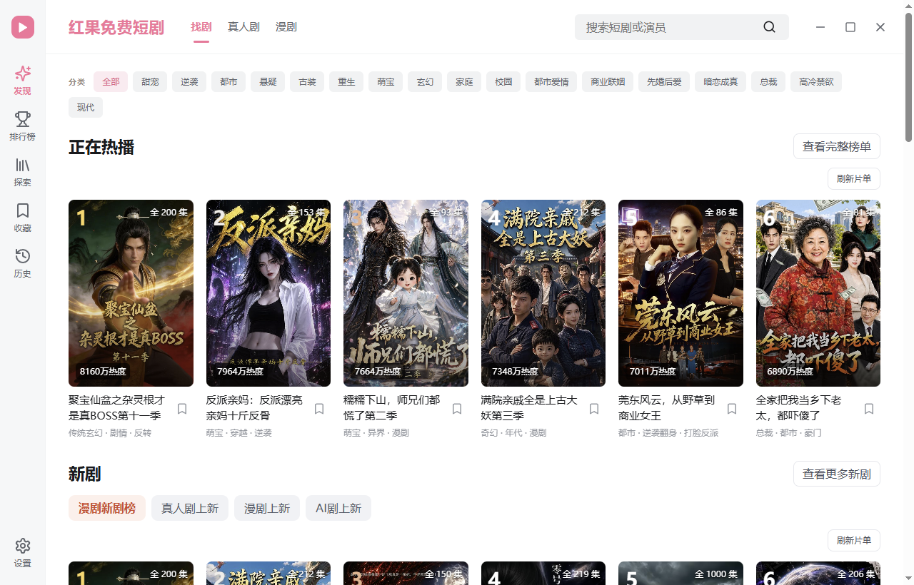

# 红果短剧电脑版｜红果桌面版

在 Windows 电脑上刷短剧——找剧、追剧、断点续看，不用再装安卓模拟器。

**免费使用** · 当前版本 **1.0.9** · 支持 Windows 10 / 11（x64）

> 📌 本仓库为镜像搬运，原作者：**渠道有数**（[waligoraamodio288-rgb](https://github.com/waligoraamodio288-rgb)）。应用本体、更新与维护均由原作者负责。

## ⬇️ 下载

**[下载 Windows 安装程序](https://github.com/waligoraamodio288-rgb/hongguo-desktop-releases/releases/download/v1.0.9/hongguo-1.0.9-windows-x86_64-setup.exe)** ｜ [固定最新版入口](https://github.com/waligoraamodio288-rgb/hongguo-desktop-releases/releases/latest) ｜ [全部版本](https://github.com/waligoraamodio288-rgb/hongguo-desktop-releases/releases)

安装包约 108 MB，只需下载 `.exe`，不需要源码包。当前版本尚未配置 Windows 代码签名，安装时如遇 SmartScreen 提示，核对下载来源后继续即可。

## ✨ 功能

- 🔍 剧集搜索、分类浏览、排行榜
- ❤️ 收藏剧集
- ▶️ 本机断点续播（观看进度保存在电脑上）
- ⏩ 倍速播放、自动连播下一集、选集分组定位
- ⌨️ 老板键一键隐藏/恢复窗口（设置里配置，不会自动暂停）

## 🚀 三步上手

1. 上方下载 `hongguo-1.0.9-windows-x86_64-setup.exe` 并安装（缺 WebView2 时会自动补装）
2. 打开应用，浏览分类或搜索剧名
3. 进详情页点播放

## ❓ 常见问题

**详情页提示"桌面内容服务尚未就绪"？**
等约 1 分钟，到「设置」→「播放服务」点「检查连接」。还不行就「设置」→「退出程序」，重开再等 1 分钟。

**播放中断？**
先点"重试"一次，换部剧对照；再去「设置」→「播放服务」检查连接。

**安装卡在 WebView2？**
到[微软官网](https://developer.microsoft.com/en-us/microsoft-edge/webview2/)下载 Evergreen Standalone Installer（x64）手动装好，再重试。

**记录不同步手机？**
观看记录和收藏只保存在当前电脑，暂不支持多设备同步。

## 💬 反馈

- [提交问题](https://github.com/waligoraamodio288-rgb/hongguo-desktop-releases/issues/new?template=bug-report.yml) ｜ [提建议](https://github.com/waligoraamodio288-rgb/hongguo-desktop-releases/issues/new?template=feature-request.yml)
- 邮件：[WaligoraAmodio288@gmail.com](mailto:WaligoraAmodio288@gmail.com)

说明系统版本、软件版本和操作步骤即可，请勿提供账号密码等隐私信息。

## 关于

这是公开发行与反馈仓库的镜像，不包含应用源码。由**渠道有数**独立维护，相关品牌与内容归各自权利方所有，播放可用性受来源及网络情况影响。
